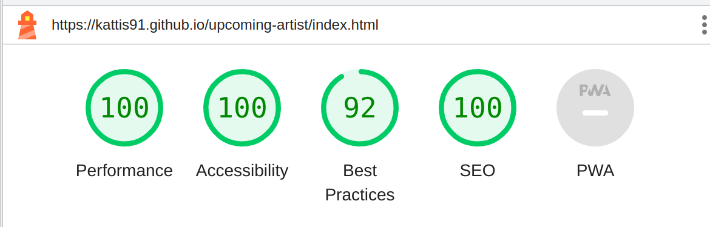

# Aske Falk

Aske Falk is a website dedicated to a musician based in Malmö and focuses on reggae music. The site aims to cater to both Aske's existing fans and newcomers to his music, making everyone feel welcome and at home on the website.

## Features

### Navigation Bar

- The complete, responsive navigation bar contains links to the Heading, Home page, Music, and Contact pages. It appears the same on every page, making navigation easier.

- This section enables the user to navigate through the pages seamlessly without relying on the "back button".

- By clicking on the heading, the user will be redirected to the home page every time.

### The home page image

- The picture is attractive because of its lively colors and depicts the artist himself.

### Upcoming events section

- With the upcoming events section, users can easily discover when Aske will be performing live.

- It displays details regarding the locations where all the gigs will be held in different cities.

### YouTube section

- This section offers the user a chance to sample Aske's music.  

### The Footer

- In the footer section, there are links to the appropriate social media platforms. By clicking on them, they will open in a new tab.

- The footer encourages users to visit Facebook and Instagram for additional updates and daily interaction.

- This section includes a link to Spotify where users can find all the music.

- The footer section remains consistent across all pages.

### The music page image 

- This section features a photo of Aske walking on the train tracks with his guitar, which complements his recent release "Tåget går" (The Train is Leaving). 

- There is a small theme that connects the Home page to the Music page, and it involves Aske and his guitar.

### The About section

- This section provides details about the artist's sound and style, giving users the opportunity to learn more about Aske.

### The Spotify section

- In this section, there are Spotify links embedded. By clicking on them, you can preview songs from three albums by the artist.-The user doesn't need a Spotify account to be able to preview.

- If the user clicks on either the Spotify logo or the title of the album, they will be directed to the Spotify website where they can log in and listen to the entire album.

### The Contact Page

- In this section, users can fill out a form to contact Aske. They can use the free text area to write any questions they have.

- When making an inquiry to Aske, the user needs to provide a name and email address to receive a prompt response.

- The form can also be used by the user to book Aske for gigs.

## User Experience (UX)

### Key Project Goal

The goal of the site is to provide comprehensive information about Aske Falk's sound and music.
The first page contains information about various gigs so visitors can instantly feel welcome to take part of the artist's "whereabouts" and even visit some live performances as far as possible.

### Target Audience 

The site will be targeted toward both Aske Falk's existing fans and "newcomers" to his music, making everyone feel welcome and at home. The site is in English to allow people from outside of Sweden to gain knowledge about the artist.

### User Stories 

#### As a site visitor I want to be able to:

- navigate the site easily to find information.
- get a quick and thorough overview of the site's features and functionalities.
- read a brief and simple description of the artist and his music.
- view the entire YouTube video without any interruptions.
- preview songs on Spotify with just a single click;
- have a simple way to get in touch with the artist if I have any queries.
- locate the links for both social media and Spotify.
- clearly see which page I am currenly viewing.
- navigate between different pages without using the "back button".
- view the site on a range of device sizes.

## Testing

In order to thoroughly test my website, I conducted a series of tests on various browsers including Google Chrome, Safari, and Mozilla Firefox. I also tested on multiple devices such as the iPhone XS, iPhone 13 Pro, Samsung Galaxy S10, and Google Pixel 6a.

I made sure to check every page using Google Chrome developer tools to confirm their responsiveness on various screen sizes.

### Manual Testing

| Feature | Expect | Action | Result |
|---------|--------|--------|--------|
| Navigation Bar (HOME) | When clicking on the "HOME" button, the user should be directed to the homepage of the site | Click on HOME in the navigation bar at the top of the page | The user is directed to the home page of the site |
| Navigation Bar (MUSIC) | When clicking on the "MUSIC" button, the user should be directed to the music page of the site | Click on MUSIC in the navigation bar at the top of the page | The user is directed to the music page of the site |
| Navigation Bar (CONTACT) | When clicking on the "CONTACT" button, the user should be directed to the contact page of the site | Click on MUSIC in the navigation bar at the top of the page | The user is directed to the music page of the site |
| Logo | When clicking on the Logo, the user should be directed to the home page of the site | Click on the Logo at the top right | The user is directed to the home page of the site |
| YouTube video | When the :arrow_forward: icon is clicked, video starts to play and :pause_button: icon displays. When the :pause_button: icon is clicked, video pauses and :arrow_forward: icon displays | Click :arrow_forward: icon / Click :pause_button: icon | Video plays and :pause_button: icon displays. Video pauses and :arrow_forward: icon displays
| Link to Facebook | When clicked, links to Aske Falks Facebook page in a new tab | Click on link | The artists Facebook page opens in a new tab |
| Link to Instagram | When clicked, links to Aske Falks Instagram page in a new tab | Click on link | The artists Instagram page opens in a new tab |
| Link to Spotify | When clicked, links to Aske Falks Spotify page in a new tab | Click on link | The artists Spotify page opens in a new tab |
| Spotify previews | When the :arrow_forward: icon is clicked, audio starts to play and :pause_button: icon displays. When the :pause_button: icon is clicked, audio pauses and :arrow_forward: icon displays | Click :arrow_forward: icon / Click :pause_button: icon | Audio plays and :pause_button: icon displays. Audio pauses and :arrow_forward: icon displays |
| Contact me form. Name inputs | When trying to submit the form without filling in the first or last name, the user should get an ":exclamation: Please fill out this field" error message | Click on submit button without filling in the first or last name (both or one of them) | The ":exclamation: Please fill out this field" error message appears when some of the name inputs fields remains blank |
| Contact me form. Textarea | When trying to submit the form without writing any message in the textarea, the user should get an ":exclamation: Please fill out this field" error message. | Click on submit button without writing any message in the textarea | The ":exclamation: Please fill out this field" error message appears when the textarea remains blank |
| Contact me form. Email address | When trying to submit the form without filling in an email address, the user should get an ":exclamation: Please fill out this field" error message | Click on submit button without filling in an email adress | The ":exclamation: Please fill out this field" error message appears when the email address field remains blank |
| Contact me form. Email address. Format| When trying to submit the form without an "@" in the email address, the user should get an ":exclamation: Please include an "@" in the email adress" error message | Click on submit button without having an "@" in the email adress | The ":exclamation: Please fill out this field" error message appears when the email address field remains blank | The ":exclamation: Please include an "@" in the email adress" error message appears on the screen if missing an "@" |

### Validator Testing 

- CSS
  - No errors were found when passing through the official [Jigsaw Validator](https://jigsaw.w3.org/css-validator/validator)
- HTML
  - Home Page
    - No errors were found when passing through the official [W3C Validator](https://validator.w3.org/)
  - Music Page
    - No errors were found when passing through the official [W3C Validator](https://validator.w3.org/)
  - Contact Page
    - No errors were found when passing through the official [W3C Validator](https://validator.w3.org/)

### Lighthouse

#### The home page

   
### Fixed Bugs

- On smaller devices:

- The Navigation Bar would lose its alignment, causing the menu items to shift to the left and appear under the site logo.

- The images displayed on both the Home page and Music page would only show the left side of the picture.

- The Youtube video would appear distorted and could be challenging to view.
  
- Without adjusting the footer, the link to Spotify would appear on a different line than the links to Facebook and Instagram. This would cause the alignment to look incorrect.
  
- Embedded Spotify links would be too close to each other making it hard to preview the songs.

- The contact form would lost its shape, as only the left side would be visible.
   
- On certain devices, such as the iPad Mini and iPad Air, there would to be a white space below the footer on the contact page.

## Credits

### Media 
 
- Both of the pictures are private and were taken by my friend.
- GNU Image Manipulation Program was used to resize the images.
- The link to the YouTube video on the Home Page has been embedded from [YouTube](https://www.youtube.com/watch?v=nTsaN-Arjac). I have made some modifications to the link.
- The links to Spotify on the Music Page are sourced from [Spotify](https://open.spotify.com/artist/47TNB33Ux4tXEC8HX2YTrX). I have made some modifications to the links.

### Content
 
- Instructions on how to make YouTube video responsive are taken from [Embed a YouTube Video in HTML and Make it Responsive (CSS included)](https://www.youtube.com/watch?v=9YffrCViTVk).

- Instructions on how to to "keep footer where it belongs" are taken from [freeCodeCamp](https://www.freecodecamp.org/news/how-to-keep-your-footer-where-it-belongs-59c6aa05c59c/).

- I used Stack Overflow, W3Schools, GeeksForGeeks and LMS to expand my knowledge and find new ideas.

- Thanks to my mentor Jubril for good briefings, feedback, tip and the opportunity to ask questions.

- Thanks to Alan, Ed, Kevin, Joshua, and Sarah from the Tutors team for helping me with diverse things.

## Deployment
 
 1. Log in to GitHub. If you haven't created an account yet, please sign up first.

 2. Find the repository for this project, _Kattis91/upcoming-artist_.

 3. Click on the **Settings** link on the top navigation bar.

 4. Click on the **Pages** link on the left side navigation bar. 

 5. In the Build and Deployment section choose **main** from the drop-down select branch menu.

 6. Click **Save**. Your live Github Pages site is now deployed at the URL shown.

The live link can be found here - https://kattis91.github.io/upcoming-artist/

 